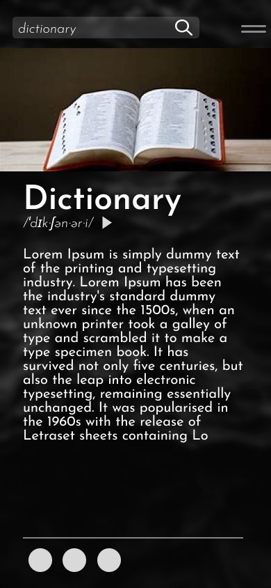

## Dictionary

 Dictionary app, developed in Kotlin. 

 

### Built With
- [![Kotlin][Kotlin.]][Kotlin-url]
- [![Retrofit][Retrofit.]][Retrofit-url]
- [![Picasso][Picasso.]][Picasso-url]
- [![Jsoup][Jsoup.]][Jsoup-url]
- [![Figma][Figma.]][Figma-url]

<!-- MARKDOWN LINKS & IMAGES -->

[Kotlin.]: https://img.shields.io/badge/Kotlin-4A4A55?style=for-the-badge&logo=kotlin&logoColor=#6db33f

[Kotlin-url]: https://kotlinlang.org/

[Retrofit.]: https://img.shields.io/badge/Retrofit-4A4A55?style=for-the-badge&logo=retrofit&logoColor=#6db33f

[Retrofit-url]: https://square.github.io/retrofit/

[Figma.]: https://img.shields.io/badge/Figma-4A4A55?style=for-the-badge&logo=figma&logoColor=ffffff

[Figma-url]: https://www.figma.com/

[Picasso.]: https://img.shields.io/badge/Picasso-4A4A55?style=for-the-badge&logo=picasso&logoColor=#6db33f

[Picasso-url]: https://square.github.io/picasso/

[Jsoup.]: https://img.shields.io/badge/Jsoup-4A4A55?style=for-the-badge&logo=jsoup&logoColor=#6db33f

[Jsoup-url]: https://jsoup.org/